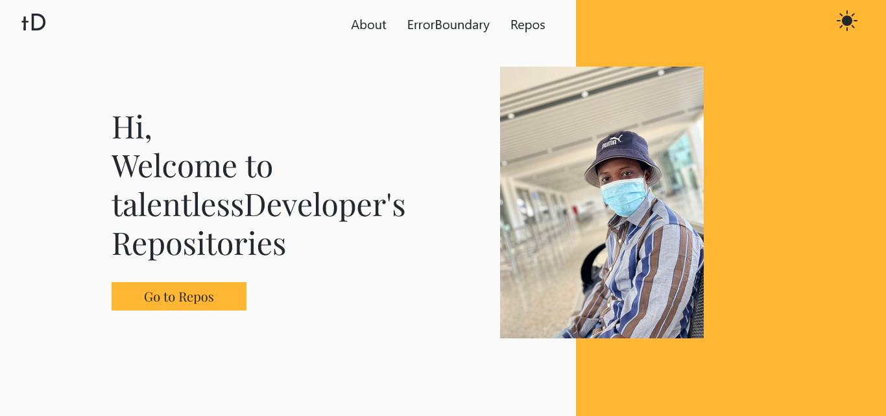

# Altschool Second Semester Exam

### Instruction

Implement an API fetch of your GitHub portfolio, show a page with a list of all your
repositories on GitHub(the page should implement pagination for the repo list), and
create another page showing data for a single repo clicked from the list of repos using
nested routes while using all the necessary tools in react. Implement the proper SEO,
Error Boundary (show a page to test the error boundary) and 404 pages. Good UI and
Designs are important.

### Hosted Link

[Hosted Repo Link](https://github-repositories-ten.vercel.app/)

### Screenshot

